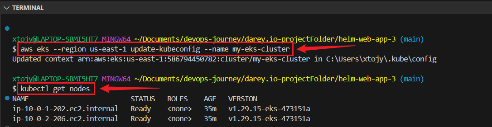
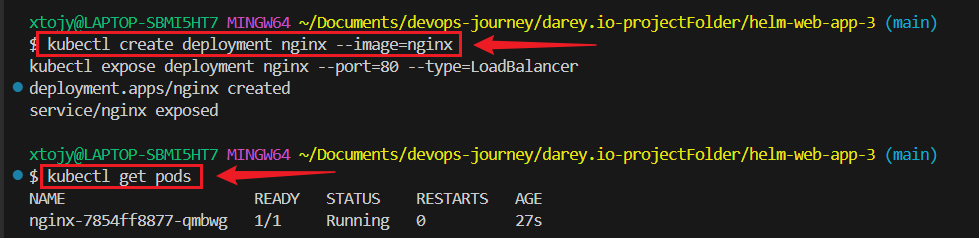
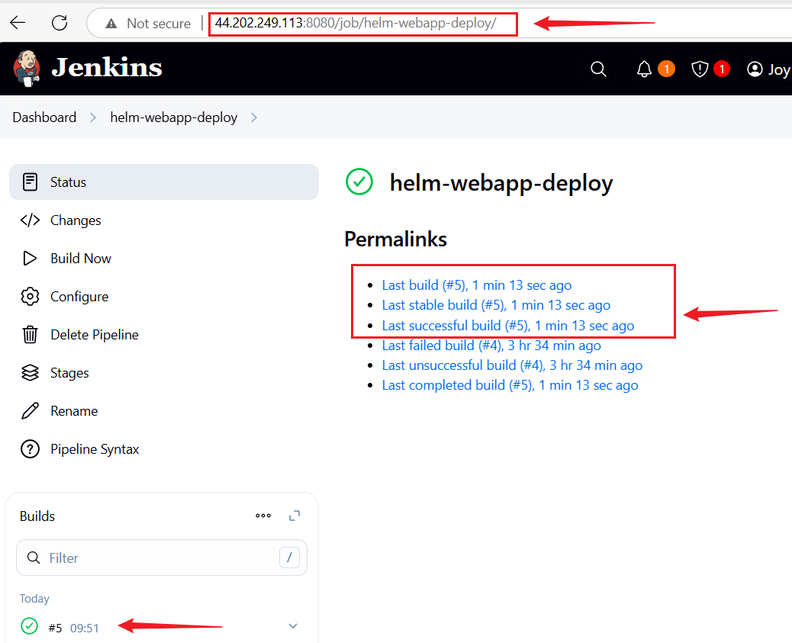
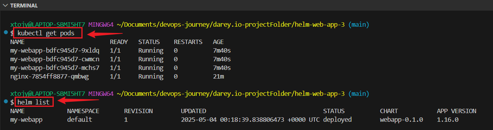
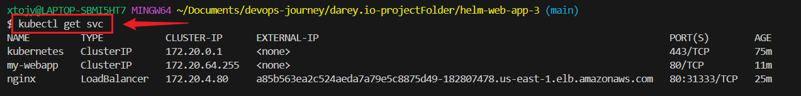
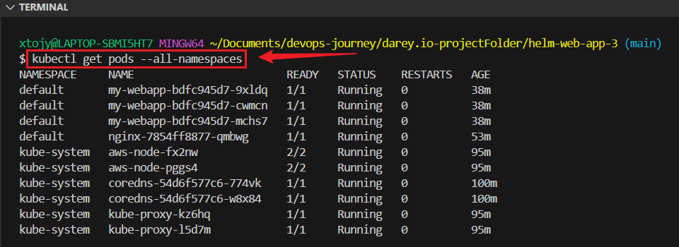
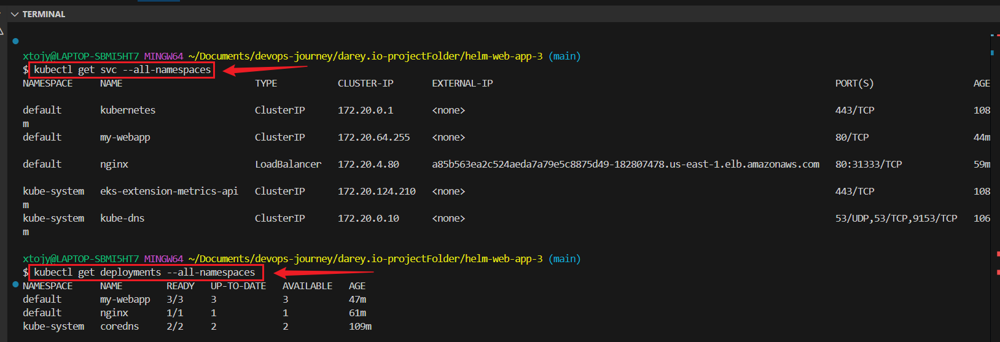
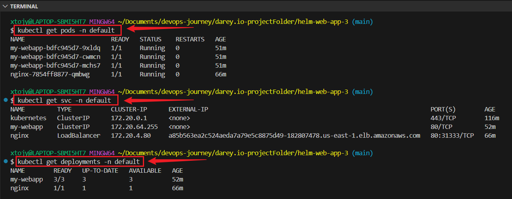
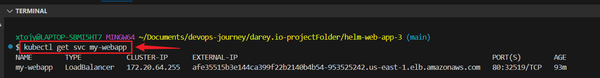
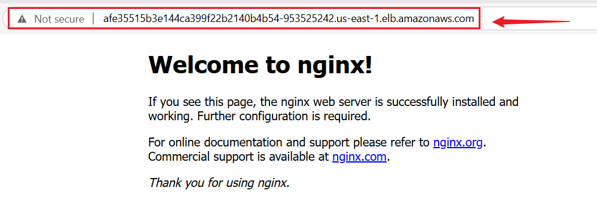

# Integrating Helm with CI/CD using Jenkins

##  Project Overview

This project demonstrates how to set up a CI/CD pipeline using Jenkins to automate the deployment of a Kubernetes application managed through Helm charts.  
It contains the complete infrastructure and application setup for deploying a web application on **Amazon Elastic Kubernetes Service (EKS)** using **Terraform**, **Helm**, and **Jenkins**, all managed from **VSCode**.

The goal is to automatically update and deploy the application every time new changes are pushed to a Git repository.


---


## Prerequisites

+ A computer system

+ Basic knowledge of Git, Helm, Kubernetes, and Jenkins

+ Helm installed on your system

+ Kubernetes cluster ready 

+ Jenkins installed on your system

---


##  Project Structure
```
helm-web-app/
├── Jenkinsfile 
├── Dockerfile
├── webapp/
│   ├── Chart.yaml
│   ├── values.yaml
│   └── templates/
│       └── deployment.yaml
├── terraform/
│   ├── main.tf
│   ├── provider.tf
│   ├── vpc.tf
│   ├── eks.tf
│   ├── outputs.tf
│   └── variables.tf
└── .gitignore
```

---


## Step-by-Step Setup
```
cd YOUR_REPO_NAME
```

## 1: Create an AWS EC2 Instance (ubuntu)
```
ssh -i<ec2-ip-address>
```


### Install Helm:
```
curl https://raw.githubusercontent.com/helm/helm/main/scripts/get-helm-3 | bash
```

### Verify:
```
helm version
```

### Install Kubernetes CLI (kubectl):

This tool helps to interact with your Kubernetes cluster.

```
sudo apt update
sudo snap install kubectl --classic
```

### Verify:
```
kubectl version --client
```


### Create a .gitignore File

```
*.tgz
.helm/
.helmignore
.kube/
*.log
# OS-generated files
.DS_Store
Thumbs.db
.vscode/
.idea/
*.swp
secrets.yaml
*.secret.yaml
.env
*.env.*
node_modules/
venv/
__pycache__/
*.bak
*.tmp

# Terraform
.terraform/
*.tfstate
*.tfstate.*
crash.log
*.tfvars
override.tf
override.tf.json
*_override.tf
*_override.tf.json
.terraform.lock.hcl
```


### Create a Dockerfile

```
# Use Nginx as the base image
FROM nginx:stable

# Copy your web app files into the Nginx HTML directory
COPY . /usr/share/nginx/html

# Expose port 80
EXPOSE 80

# Start Nginx
CMD ["nginx", "-g", "daemon off;"]
```

###  Install Docker on the AWS EC2 Instance
```
sudo apt update
curl -fsSL https://get.docker.com -o get-docker.sh
sudo sh get-docker.sh
sudo usermod -aG docker $USER
newgrp docker
```
**Then logout and back in**

### Create Dockerfile
```
docker login -u username -p password
nano Dockerfile
```
```
# Use Nginx as the base image
FROM nginx:stable

# Copy your web app files into the Nginx HTML directory
COPY . /usr/share/nginx/html

# Expose port 80
EXPOSE 80

# Start Nginx
CMD ["nginx", "-g", "daemon off;"]
```

### Create .dockerignore File
Paste
```
*.tar
*.zip
*.log
node_modules
.vscode
.git
*.lz4
```

## On The Instance Run:

```
docker build -t <your-dockerhub-username>/<your-image-name>:<tag> .
docker push <your-dockerhub-username>/<your-image-name>:<tag> 
```


## Create a File:
```
nano jenkins.sh
```
**Paste**
```
#!/bin/bash

# The jenkins & docker shell script that will run on instance initialization


# Install jenkins and java
sudo apt-get update
sudo apt install openjdk-17-jre -y

curl -fsSL https://pkg.jenkins.io/debian-stable/jenkins.io-2023.key | sudo tee \
  /usr/share/keyrings/jenkins-keyring.asc > /dev/null
echo deb [signed-by=/usr/share/keyrings/jenkins-keyring.asc] \
  https://pkg.jenkins.io/debian-stable binary/ | sudo tee \
  /etc/apt/sources.list.d/jenkins.list > /dev/null
sudo apt-get update
sudo apt-get install jenkins -y


# Install docker
sudo apt-get install ca-certificates curl gnupg -y

sudo install -m 0755 -d /etc/apt/keyrings
curl -fsSL https://download.docker.com/linux/ubuntu/gpg | sudo gpg --dearmor -o /etc/apt/keyrings/docker.gpg
sudo chmod a+r /etc/apt/keyrings/docker.gpg
echo \
  "deb [arch="$(dpkg --print-architecture)" signed-by=/etc/apt/keyrings/docker.gpg] https://download.docker.com/linux/ubuntu \
  "$(. /etc/os-release && echo "$VERSION_CODENAME")" stable" | \
  sudo tee /etc/apt/sources.list.d/docker.list > /dev/null

sudo apt-get update
sudo apt-get install docker-ce docker-ce-cli containerd.io docker-buildx-plugin docker-compose-plugin -y


# Add ubuntu & Jenkins to the Docker group
sudo usermod -aG docker ubuntu
sudo usermod -aG docker jenkins

# run docker test container 
sudo docker run hello-world

# curl "https://awscli.amazonaws.com/awscli-exe-linux-x86_64.zip" -o "awscliv2.zip"
unzip awscliv2.zip
sudo ./aws/install

# start & enable jenkins
sudo systemctl start jenkins
sudo systemctl enable jenkins
```

### Make it Executable and Run the Script:
```
chmod +x
./jenkins.sh
```


###  Install kubectl and aws-iam-authenticator:
```
aws configure
sudo su - jenkins
aws sts get-caller-identity

# Install kubectl
curl -LO "https://dl.k8s.io/release/$(curl -sL https://dl.k8s.io/release/stable.txt)/bin/linux/amd64/kubectl"
sudo install -o root -g root -m 0755 kubectl /usr/local/bin/kubectl
chmod +x kubectl
kubectl version --client
kubectl get nodes


# Install aws-iam-authenticator
curl -Lo aws-iam-authenticator https://github.com/kubernetes-sigs/aws-iam-authenticator/releases/latest/download/aws-iam-authenticator-linux-amd64
chmod +x aws-iam-authenticator
sudo mv aws-iam-authenticator /usr/local/bin/


sudo mv aws-iam-authenticator /usr/local/bin
aws eks list-clusters --region us-east-1
aws eks describe-cluster --region us-east-1 --name my-eks-cluster --query "cluster.status
aws eks update-kubeconfig --region <your-region> --name <cluster-name>
aws eks --region <region> update-kubeconfig --name my-eks-cluster
```


### Create an EKS Cluster Using Terraform
On Terminal:

Configure AWS CLI
```
aws configure
```

**provider.tf**
```
provider "aws" {
  region = "us-east-1"
}
```

**vpc.tf**
```
module "vpc" {
  source  = "terraform-aws-modules/vpc/aws"
  version = "5.1.1" 

  name = "eks-vpc"
  cidr = "10.0.0.0/16"

  azs             = ["us-east-1a", "us-east-1b"]
  private_subnets = ["10.0.1.0/24", "10.0.2.0/24"]
  public_subnets  = ["10.0.3.0/24", "10.0.4.0/24"]

  enable_nat_gateway = true
  single_nat_gateway = true

  tags = {
    Name        = "eks-vpc"
    Environment = "dev"
  }
}
```

**output.tf**
```
output "cluster_name" {
  value = module.eks.cluster_name
}

output "kubeconfig_command" {
  value = "aws eks --region us-east-1 update-kubeconfig --name ${module.eks.cluster_name}"
}
```


**variable.tf**
```
variable "region" {
  default = "us-east-1"
}
```


### Initialize Terraform
After the above steps, run:
```
terraform init
terraform validate
terraform plan
terraform apply
```

#### Update kubeconfig:
```
aws eks --region us-east-1 update-kubeconfig --name my-eks-cluster
```

### Check cluster nodes:
```
kubectl get nodes
```



### Test a deployment (e.g., NGINX):
```
kubectl create deployment nginx --image=nginx
kubectl expose deployment nginx --port=80 --type=LoadBalancer
```



### Check pod status:
```
kubectl get pods
```


### Open Jenkins on Browser:
```
http://<ec2-ip-address>:8080
```

### On AWS EC2 Instance 
+ Unlock Jenkins with the admin password found here:
```
sudo cat /var/log/jenkins/jenkins.log
```
**Copy password and paste on browser**

+ Install necessary plugins


### 5: Create Jenkins Pipeline Job

#### 1 : Configure Automatic Build Trigger
Set Jenkins to automatically detect new commits in Git repository:

**+ GitHub Webhook :**

+ Go to your GitHub repository settings.

+ Navigate to Webhooks → Add webhook.

+ Enter the URL for your Jenkins Git plugin:
```
http://<your-EC2-public-IP>:8080/github-webhook/
```

+ Select Push events.

+ Save the webhook.

+ Jenkins will now trigger builds when you push code to your GitHub repository.


#### 2: GitHub Credentials:

+ In Jenkins, go to Manage Jenkins → Credentials.

+ Add your GitHub username/password or token.


#### 3. Create a New Pipeline:

+ In Jenkins, click New Item → Pipeline.

+ Name it **helm-webapp-deploy** and click OK.


#### 4: Set Up Pipeline:

+ Create a Jenkinsfile:

**Paste**
```
pipeline {
    agent any

    environment {
        AWS_DEFAULT_REGION = 'us-east-1'
        DOCKERHUB_IMAGE = 'joanna2/my-webapp:latest'
    }

    triggers {
        githubPush()
    }

    stages {
        stage('Build and Push Docker Image') {
            steps {
                withCredentials([usernamePassword(
                    credentialsId: 'docker-cred',
                    usernameVariable: 'DOCKER_USERNAME',
                    passwordVariable: 'DOCKER_PASSWORD'
                )]) {
                    sh '''
                        echo " Building Docker image..."
                        docker build -t $DOCKERHUB_IMAGE .

                        echo " Logging in to Docker Hub..."
                        echo $DOCKER_PASSWORD | docker login -u $DOCKER_USERNAME --password-stdin

                        echo " Pushing image to Docker Hub..."
                        docker push $DOCKERHUB_IMAGE

                        echo " Cleaning up local image..."
                        docker rmi $DOCKERHUB_IMAGE || true
                    '''
                }
            }
        }

        stage('Deploy with Helm') {
            when {
                expression {
                    env.GIT_BRANCH == 'origin/main' || env.GIT_BRANCH == 'origin/develop'
                }
            }
            steps {
                withCredentials([usernamePassword(
                    credentialsId: 'aws-cred',
                    usernameVariable: 'AWS_ACCESS_KEY_ID',
                    passwordVariable: 'AWS_SECRET_ACCESS_KEY'
                )]) {
                    sh '''
                        export AWS_ACCESS_KEY_ID=$AWS_ACCESS_KEY_ID
                        export AWS_SECRET_ACCESS_KEY=$AWS_SECRET_ACCESS_KEY

                        echo "Configuring access to EKS..."
                        aws eks --region ${AWS_DEFAULT_REGION} update-kubeconfig --name my-eks-cluster

                        echo "Deploying to EKS with Helm..."
                        helm upgrade --install my-webapp ./webapp --namespace default
                    '''
                }
            }
        }
    }
}
```


### **Step 4: Set Pipeline Source to Git**
1. **Select "Pipeline script from SCM"**:
   - In the **Definition** dropdown, choose **"Pipeline script from SCM"**. This tells Jenkins to pull the pipeline script directly from Git repository.


2. **Choose SCM Type**:
   - Select **Git** as the Source Code Management (SCM) system.

3. **Enter Your Repository URL**:
   - Paste GitHub repository URL (e.g., `https://github.com/username/repository.git`) into the **Repository URL** field.


4. **Credentials**:
   - If your repository is private:
     - Click **Add** next to the **Credentials** field.
     - Choose **Username and Password**, and provide your aws username and password .
   - Select the credentials you just added.


## Docker Hub Credentials
**In Jenkins, go to Manage Jenkins > Credentials > (your domain).**

+ Add a new Username and Password credential:

+ **ID:** dockerhub-cred (must match your Jenkinsfile).

+ **Username:** Your Docker Hub username.

+ **Password:** Your Docker Hub password or token.

+ **Scope:** Global.

**Also add Docker hub credentials to Jenkins**


5. **Branch to Build**:
   - Under **Branches to build**, specify the branch you want Jenkins to use (`main`).


### **Step 4: Save and Trigger the Pipeline**
1. Click **Save** at the bottom of the configuration page.
2. pipeline is now connected to Git!
3. To test it:
   - Make a code commit in your Git repository.
   - Jenkins will detect the commit and automatically trigger the pipeline (if set up for automatic builds).


---

## 6: Update Helm Chart
Edit values.yaml:

Change the number of replicas:
```
replicaCount: 3
```


## 7: Edit templates/deployment.yaml:
Update the resources section:
```
resources:
  requests:
    memory: "180Mi"
    cpu: "120m"
```

## Deploy a Test App:
verify that the cluster is working by deploying a sample NGINX app:
```
kubectl create deployment nginx --image=nginx
kubectl expose deployment nginx --port=80 --type=LoadBalancer
kubectl get svc nginx
```


## 8: Commit and Push Changes
Run the following commands:

```
git add .
git commit -m "Updated replicas, memory, and CPU requests"
git push origin main
```

This will push the changes to GitHub.


## Verify Build On Jenkins:


## Verify Helm Deployment:
```
helm list
kubectl get nodes
```



## Verify Deployed Application:
```
kubectl get svc
```



## Check Cluster Resources (confirm everything is running):
```
kubectl get pods --all-namespaces
kubectl get svc --all-namespaces
```




## Focused Checks
```
kubectl get pods -n default
kubectl get svc -n default
kubectl get deployments -n default
```



## Test nginx App On Browser: 
Open your browser and navigate to:
```
http://a85b563ea2c524aeda7a79e5c8875d49-182807478.us-east-1.elb.amazonaws.com
```


## Make my-webapp Accessible:
Change the Service type to LoadBalancer
```
kubectl edit svc my-webapp
```


## Change Spec to
```
spec:
  type: LoadBalancer
```


## Get External IP:
```
kubectl get svc my-webapp
```


## Test app on Browser:
```
http://<your-external-ip>
```


## Clean Up terraform Resources:
```
terraform destroy
```


## Conclusion

This project demonstrates a full-stack, automated deployment pipeline using modern DevOps tools. I provisioned infrastructure with Terraform, deploy with Helm, and manage CI/CD via Jenkins — all within a developer-friendly VSCode environment.


### Push to GitHub
```
git add .
git commit -m "updated file"
git push origin main
```


### 🧑‍💻 Author

### Your Name: Joy Nwatuzor

### 🎉 Happy DevOps-ing and Helming!