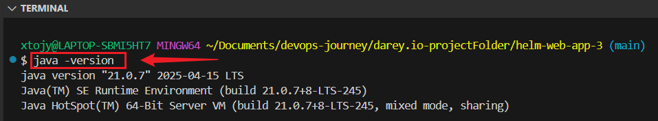
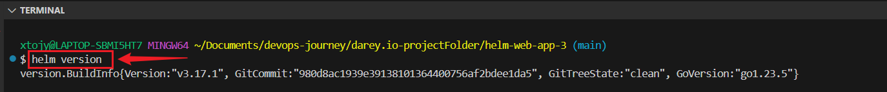

# 🚀 Integrating Helm with CI/CD using Jenkins

## 📚 Project Overview

This project demonstrates how to set up a CI/CD pipeline using Jenkins to automate the deployment of a Kubernetes application managed through Helm charts.
The goal is to automatically update and deploy the application every time new changes are pushed to a Git repository.

---


## 🛠️ Prerequisites

+ A computer system

+ Basic knowledge of Git, Helm, Kubernetes, and Jenkins

+ Helm installed on your system

+ Kubernetes cluster ready (e.g., Minikube)

+ Jenkins installed on your system

---


## 📁 Project Structure
```
helm-web-app/
├── Jenkinsfile 
├── webapp/
│   ├── Chart.yaml
│   ├── values.yaml
│   └── templates/
│       └── deployment.yaml
```

---


## 📥 Step-by-Step Setup

### 1: Install Java

Jenkins requires Java to run.
Install Java JDK 21 and verify with:
```
java -version
```



### 2: Install Jenkins On Windows

+ Download Jenkins for Windows from https://www.jenkins.io/download/.

+ Install it using the default settings.

+ Open Jenkins in your browser at http://localhost:8080.

+ Unlock Jenkins with the admin password found here:

```
type C:\Program Files\Jenkins\secrets\initialAdminPassword
```

Install Suggested Plugins.

Create your admin user.


### 3:Install Helm
Install Helm from https://helm.sh/docs/intro/install/.

Confirm Helm is installed by running:
```
helm version
```


---


### 4: Find the Helm Binary Path
Open PowerShell and run:
```
Get-Command helm | Select-Object -ExpandProperty Source
```
**Note: Copy this path for Jenkins pipeline.**

## Create an AWS EC2 Instance (ubuntu)
```
ssh -i<ec2-ip-address>
```


### Install Helm:
```
curl https://raw.githubusercontent.com/helm/helm/main/scripts/get-helm-3 | bash
```

### Verify:
```
helm version
```

### Install Kubernetes CLI (kubectl):

This tool lets you interact with your Kubernetes cluster.

```
sudo apt update
sudo snap install kubectl --classic
```

### Verify:
```
kubectl version --client
```


## Create a File:
```
nano jenkins.sh
```

**Paste**
```
#!/bin/bash

# The jenkins & docker shell script that will run on instance initialization


# Install jenkins and java
sudo apt-get update
sudo apt install openjdk-17-jre -y

curl -fsSL https://pkg.jenkins.io/debian-stable/jenkins.io-2023.key | sudo tee \
  /usr/share/keyrings/jenkins-keyring.asc > /dev/null
echo deb [signed-by=/usr/share/keyrings/jenkins-keyring.asc] \
  https://pkg.jenkins.io/debian-stable binary/ | sudo tee \
  /etc/apt/sources.list.d/jenkins.list > /dev/null
sudo apt-get update
sudo apt-get install jenkins -y


# Install docker
sudo apt-get install ca-certificates curl gnupg -y

sudo install -m 0755 -d /etc/apt/keyrings
curl -fsSL https://download.docker.com/linux/ubuntu/gpg | sudo gpg --dearmor -o /etc/apt/keyrings/docker.gpg
sudo chmod a+r /etc/apt/keyrings/docker.gpg
echo \
  "deb [arch="$(dpkg --print-architecture)" signed-by=/etc/apt/keyrings/docker.gpg] https://download.docker.com/linux/ubuntu \
  "$(. /etc/os-release && echo "$VERSION_CODENAME")" stable" | \
  sudo tee /etc/apt/sources.list.d/docker.list > /dev/null

sudo apt-get update
sudo apt-get install docker-ce docker-ce-cli containerd.io docker-buildx-plugin docker-compose-plugin -y


# Add ubuntu & Jenkins to the Docker group
sudo usermod -aG docker ubuntu
sudo usermod -aG docker jenkins

# run docker test container 
sudo docker run hello-world

# curl "https://awscli.amazonaws.com/awscli-exe-linux-x86_64.zip" -o "awscliv2.zip"
unzip awscliv2.zip
sudo ./aws/install

# start & enable jenkins
sudo systemctl start jenkins
sudo systemctl enable jenkins
```

### Make it Executable and Run the Script:
```
chmod +x
./jenkins.sh
```

### Open Jenkins on Browser:
```
http://<ec2-ip-address>:8080
```

###  Install kubectl and aws-iam-authenticator:
```
aws configure
sudo su - jenkins
aws sts get-caller-identity

# Install kubectl
curl -LO "https://dl.k8s.io/release/$(curl -sL https://dl.k8s.io/release/stable.txt)/bin/linux/amd64/kubectl"
sudo install -o root -g root -m 0755 kubectl /usr/local/bin/kubectl
kubectl version --client
kubectl get nodes


# Install aws-iam-authenticator
curl -Lo aws-iam-authenticator https://github.com/kubernetes-sigs/aws-iam-authenticator/releases/latest/download/aws-iam-authenticator-linux-amd64
chmod +x aws-iam-authenticator
sudo mv aws-iam-authenticator /usr/local/bin/


sudo mv aws-iam-authenticator /usr/local/bin
aws eks list-clusters --region us-east-1
aws eks describe-cluster --region us-east-1 --name my-eks-cluster --query "cluster.status
aws eks update-kubeconfig --region <your-region> --name <cluster-name>
aws eks --region <region> update-kubeconfig --name my-eks-cluster
```

### On AWS EC2 Instance 
+ Unlock Jenkins with the admin password found here:
```
sudo cat /var/log/jenkins/jenkins.log
```
**Copy password and paste on browser**


### 5: Create Jenkins Pipeline Job

#### 1 : Configure Automatic Build Trigger
Set Jenkins to automatically detect new commits in Git repository:

**+ GitHub Webhook :**

+ Go to your GitHub repository settings.

+ Navigate to Webhooks → Add webhook.

+ Enter the URL for your Jenkins Git plugin:
```
http://<your-EC2-public-IP>:8080/github-webhook/
```

+ Select Push events.

+ Save the webhook.

+ Jenkins will now trigger builds when you push code to your GitHub repository.


#### 2: GitHub Credentials:

+ In Jenkins, go to Manage Jenkins → Credentials.

+ Add your GitHub username/password or token.


#### 3. Create a New Pipeline:

+ In Jenkins, click New Item → Pipeline.

+ Name it **helm-webapp-deploy** and click OK.


#### 4: Set Up Pipeline:

+ Create a Jenkinsfile:

**Paste**
```
pipeline {
    agent any

    environment {
        AWS_DEFAULT_REGION = 'us-east-1'
    }

    stages {
        stage('Deploy with Helm') {
            steps {
                withCredentials([usernamePassword(credentialsId: 'aws-creds', usernameVariable: 'AWS_ACCESS_KEY_ID', passwordVariable: 'AWS_SECRET_ACCESS_KEY')]) {
                    sh '''
                        export AWS_ACCESS_KEY_ID=$AWS_ACCESS_KEY_ID
                        export AWS_SECRET_ACCESS_KEY=$AWS_SECRET_ACCESS_KEY
                        aws eks --region us-east-1 update-kubeconfig --name my-eks-cluster
                        helm upgrade --install my-webapp ./webapp --namespace default
                    '''
                }
            }
        }
    }
}
```

### **Step 4: Set Pipeline Source to Git**
1. **Select "Pipeline script from SCM"**:
   - In the **Definition** dropdown, choose **"Pipeline script from SCM"**. This tells Jenkins to pull the pipeline script directly from Git repository.


2. **Choose SCM Type**:
   - Select **Git** as the Source Code Management (SCM) system.

3. **Enter Your Repository URL**:
   - Paste GitHub repository URL (e.g., `https://github.com/username/repository.git`) into the **Repository URL** field.


4. **Credentials**:
   - If your repository is private:
     - Click **Add** next to the **Credentials** field.
     - Choose **Username and Password**, and provide your aws username and password .
   - Select the credentials you just added.


5. **Branch to Build**:
   - Under **Branches to build**, specify the branch you want Jenkins to use (`main`).


### **Step 4: Save and Trigger the Pipeline**
1. Click **Save** at the bottom of the configuration page.
2. pipeline is now connected to Git!
3. To test it:
   - Make a code commit in your Git repository.
   - Jenkins will detect the commit and automatically trigger the pipeline (if set up for automatic builds).


---

## 6: Update Helm Chart
Edit values.yaml:

Change the number of replicas:
```
replicaCount: 3
```


## 7: Edit templates/deployment.yaml:
Update the resources section:
```
resources:
  requests:
    memory: "180Mi"
    cpu: "120m"
```


## 8: Commit and Push Changes
Run the following commands:

```
git add .
git commit -m "Updated replicas, memory, and CPU requests"
git push origin main
```

This will push the changes to GitHub.


## ✅ Conclusion

This project shows how Helm can simplify Kubernetes application deployments through templated configuration and version-controlled charts. Helm does not only helps maintain consistency across environments but also empowers teams to deploy and manage applications at scale with confidence.